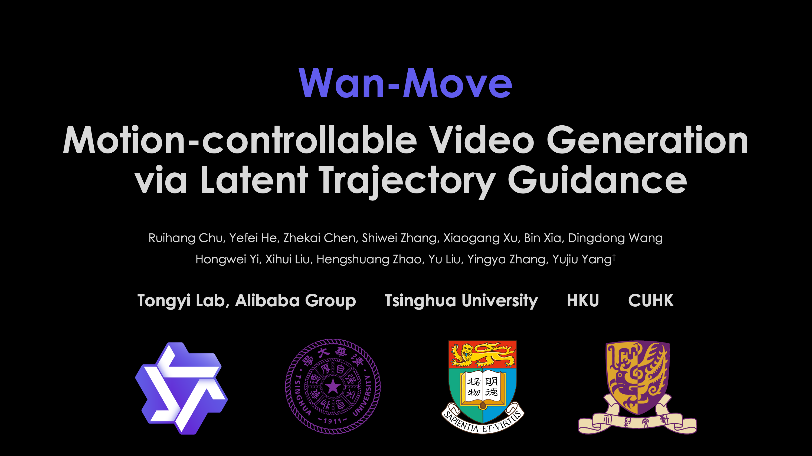
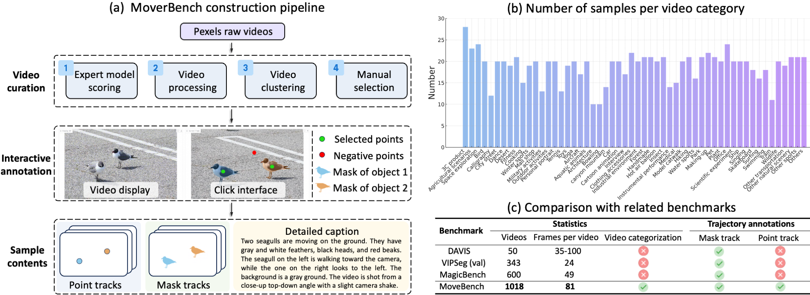

# Wan-Move: Motion-controllable Video Generation via Latent Trajectory Guidance

[](https://arxiv.org/abs/2512.08765)
[](https://github.com/ali-vilab/Wan-Move)
[](https://huggingface.co/Ruihang/Wan-Move-14B-480P)
[](https://modelscope.cn/models/churuihang/Wan-Move-14B-480P)
[](https://huggingface.co/datasets/Ruihang/MoveBench)
[](https://www.youtube.com/watch?v=_5Cy7Z2NQJQ)
[](https://wan-move.github.io/)

<div align="center">

[](https://www.youtube.com/watch?v=_5Cy7Z2NQJQ)

</div>

## 💡 TLDR: Bring Wan I2V to SOTA fine-grained, point-level motion control!

**Wan-Move: Motion-controllable Video Generation via Latent Trajectory Guidance [[Paper](https://arxiv.org/abs/2512.08765)]** <br />
[Ruihang Chu](https://scholar.google.com/citations?hl=zh-CN&user=62zPPxkAAAAJ), [Yefei He](https://hexy.tech/), [Zhekai Chen](https://scholar.google.com/citations?user=_eZWcIMAAAAJ), [Shiwei Zhang](https://scholar.google.com/citations?user=ZO3OQ-8AAAAJ), [Xiaogang Xu](https://xuxiaogang.com/), [Bin Xia](https://zj-binxia.github.io/), [Dingdong Wang](https://scholar.google.com/citations?user=hRWxWiEAAAAJ), [Hongwei Yi](https://scholar.google.com/citations?user=ocMf7fQAAAAJ), [Xihui Liu](https://xh-liu.github.io/), [Hengshuang Zhao](https://hszhao.github.io/), [Yu Liu](https://scholar.google.com/citations?user=8zksQb4AAAAJ), [Yingya Zhang](https://scholar.google.com/citations?user=16RDSEUAAAAJ), [Yujiu Yang](https://sites.google.com/view/iigroup-thu/about) <br />

We present our NeurIPS 2025 paper Wan-Move, a simple and scalable motion-control framework for video generation. Wan-Move offers the following key features:
- 🎯 **High-Quality 5s 480p Motion Control**: Through scaled training, Wan-Move can generate 5-second, 480p videos with SOTA motion controllability on par with commercial systems such as Kling 1.5 Pro’s Motion Brush, as verified via user studies.
- 🧩 **Novel latent Trajectory Guidance**: Our core idea is to represent the motion condition by propagating the first frame’s features along the trajectory, which can be seamlessly integrated into off-the-shelf image-to-video models (e.g., Wan-I2V-14B) without any architecture change or extra motion modules.

- 🕹️ **Fine-grained Point-level Control**: Object motions are represented with dense point trajectories, enabling precise, region-level control over how each element in the scene moves.

- 📊 **Dedicated Motion-control Benchmark MoveBench**: MoveBench is a carefully curated benchmark with larger-scale samples, diverse content categories, longer video durations, and high-quality trajectory annotations.

🙌 We’re glad to see Wan-Move being tested in real-world videos by many creators and users, with consistently positive feedback.

## 🔥 Latest News!!

* Dec 15, 2025: 👋 We've released a [local Gradio demo](#gradio-demo) for interactive trajectory drawing and video generation.
* Dec 10, 2025: 👋 We've released the [inference code](#quickstart), [model weights](https://huggingface.co/Ruihang/Wan-Move-14B-480P), and [MoveBench](https://huggingface.co/datasets/Ruihang/MoveBench) of Wan-Move.
* Sep 18, 2025: 👋 Wan-Move has been accepted by NeurIPS 2025! 🎉🎉🎉

## Community Works
* **[ComfyUI]** Thank Kijai for integrating Wan-Move into the ComfyUI wrapper: [https://huggingface.co/Kijai/WanVideo_comfy_fp8_scaled/tree/main/WanMove](https://huggingface.co/Kijai/WanVideo_comfy_fp8_scaled/tree/main/WanMove)

* Thanks deepbeepmeep for supporting Wan-Move in Wan2GP, requiring low VRAM for video generation: https://github.com/deepbeepmeep/Wan2GP


## 📑 Todo List
- Wan-Move-480P
    - [x] Multi-GPU inference code of the 14B models
    - [x] Checkpoints of the 14B models
    - [x] Data and evaluation code of MoveBench
    - [x] Gradio demo


## Introduction of Wan-Move


<p align="center" style="border-radius: 10px">
  
<strong>Wan-Move spports diverse motion control applications in image-to-video generation. The generated samples (832×480p, 5s) exhibits high visual fidelity and accurate motion.</strong>
</p>

<p align="center" style="border-radius: 10px">
  
<strong>The framework of Wan-Move. (a) How to inject motion guidance. (b) Training pipeline. </strong>
</p>

<p align="center" style="border-radius: 10px">
  
<strong>The contruction pipeline and statistics of MoveBench. Welcome everyone to use it! </strong>
</p>

<p align="center" style="border-radius: 10px">
  
<strong>Qualitative comparisons between Wan-Move and academic methods and commercial solutions. </strong>
</p>


## Quickstart

#### Installation

> 💡Note: Wan-Move is implemented as a minimal extension on top of the [Wan2.1](https://github.com/Wan-Video/Wan2.1) codebase. If you have tried Wan2.1, you can reuse most of your existing setup with very low migration cost.

Clone the repo:
```sh
git clone  https://github.com/ali-vilab/Wan-Move.git
cd Wan-Move
```

Install dependencies:
```sh
# Ensure torch >= 2.4.0
pip install -r requirements.txt
```


#### Model Download

| Models       | Download Link                                                                                                                                           |    Notes                      |
|--------------|---------------------------------------------------------------------------------------------------------------------------------------------------------|-------------------------------|
| Wan-Move-14B-480P      | 🤗 [Huggingface](https://huggingface.co/Ruihang/Wan-Move-14B-480P)      🤖 [ModelScope](https://modelscope.cn/models/churuihang/Wan-Move-14B-480P)             | 5s 480P video generation


Download models using huggingface-cli:
``` sh
pip install "huggingface_hub[cli]"
huggingface-cli download Ruihang/Wan-Move-14B-480P --local-dir ./Wan-Move-14B-480P
```

Download models using modelscope-cli:
``` sh
pip install modelscope
modelscope download churuihang/Wan-Move-14B-480P --local_dir ./Wan-Move-14B-480P
```
#### Evaluation on MoveBench

Download MoveBench from Hugging Face
``` sh
huggingface-cli download Ruihang/MoveBench --local-dir ./MoveBench --repo-type dataset
```

> 💡Note:
> * MoveBench has provided the video captions. For a fair evaluation, you should turn off the [prompt extension](https://github.com/Wan-Video/Wan2.1?tab=readme-ov-file#2-using-prompt-extension-1) function developed in Wan2.1.
> * MoveBench provides both data in English and Chinese versions. You can select the language via the `--language` flag: use `en` for English and `zh` for Chinese.

- Single-GPU inference

``` sh
# For single-object motion test, run: 
python generate.py --task wan-move-i2v --size 480*832 --ckpt_dir ./Wan-Move-14B-480P --mode single --language en --save_path results/en --eval_bench

# For multi-object motion test, run: 
python generate.py --task wan-move-i2v --size 480*832 --ckpt_dir ./Wan-Move-14B-480P --mode multi --language en --save_path results/en --eval_bench
```

> 💡Note:
> * If you want to visualize the trajectory motion effect in our video demo, add the `--vis_track` flag. We also provide a separate visualization script, i.e., `scripts/visualize.py`, to support different visualization settings, for example, enabling mouse-button effects! 😊😊😊
> * If you encounter OOM (Out-of-Memory) issues, you can use the `--offload_model True` and `--t5_cpu` options to reduce GPU memory usage.
> * The 14B model can be run in a **single 40GB** GPU with `--t5_cpu --offload_model True --dtype bf16`! 🤗🤗🤗


- Multi-GPU inference

  Following Wan2.1, Wan-Move also supports FSDP and [xDiT](https://github.com/xdit-project/xDiT) USP to accelerate inference. When running multi-GPU batch evaluation (e.g., evaluating MoveBench or a file containing multiple test cases), you should **disable**  the [`Ulysses`](https://arxiv.org/abs/2309.14509) strategy by setting `--ulysses_size 1`. Ulysses is only supported when generating a single video with multi-GPU inference.

``` sh
# For single-object motion test, run: 
torchrun --nproc_per_node=8 generate.py --task wan-move-i2v --size 480*832 --ckpt_dir ./Wan-Move-14B-480P --mode single --language en --save_path results/en --eval_bench --dit_fsdp --t5_fsdp

# For multi-object motion test, run: 
torchrun --nproc_per_node=8 generate.py --task wan-move-i2v --size 480*832 --ckpt_dir ./Wan-Move-14B-480P --mode multi --language en --save_path results/en --eval_bench --dit_fsdp --t5_fsdp
```
After all results are generated, you can change the results storage path inside `MoveBench/bench.py`, then run:

``` sh
python MoveBench/bench.py
```

#### Run the Default Example

For single video generation, (not evaluating MoveBench), we also provide
a sample case in the `examples` folder. You can directly run:

```sh
python generate.py \
  --task wan-move-i2v \
  --size 480*832 \
  --ckpt_dir ./Wan-Move-14B-480P \
  --image examples/example.jpg \
  --track examples/example_tracks.npy \
  --track_visibility examples/example_visibility.npy \
  --prompt "A laptop is placed on a wooden table. The silver laptop is connected to a small grey external hard drive and transfers data through a white USB-C cable. The video is shot with a downward close-up lens." \
  --save_file example.mp4
```
#### Gradio Demo
We provide a local Gradio demo for interactive trajectory drawing and video generation.

1. **Launch the Demo**:
```bash
python gradio_app.py \
    --task wan-move-i2v \
    --size 480*832 \
    --ckpt_dir ./Wan-Move-14B-480P \
    --t5_cpu \
    --offload_model True \
    --dtype bf16 \
    --port 7860 \
    --share
```

2. **Features**:
   *   **Multi-Trajectory Control**: Draw multiple trajectories with distinct colors.
   *   **Speed Control**: Adjust the speed curve for each trajectory independently.
   *   **Real-time Preview**: Visualize your drawn trajectories on the input image and as a GIF.
   *   **Lazy Loading**: The model loads only when you start generation, ensuring fast startup.
   *   **History Gallery**: View your previously generated videos.

3. **Usage**:
   *   Upload an image.
   *   Click on the image to add trajectory points.
   *   (Optional) Adjust the speed curve in the editor.
   *   Select "Create New..." in the dropdown to add more trajectories.
   *   Click "Generate Video".


## Citation
If you find our work helpful, please cite us.

```
@article{chu2025wan,
      title={Wan-Move: Motion-controllable Video Generation via Latent Trajectory Guidance},
      author={Ruihang Chu and Yefei He and Zhekai Chen and Shiwei Zhang and Xiaogang Xu and Bin Xia and Dingdong Wang and Hongwei Yi and Xihui Liu and Hengshuang Zhao and Yu Liu and Yingya Zhang and Yujiu Yang},
      year={2025},
      eprint={2512.08765},
      archivePrefix={arXiv},
      primaryClass={cs.CV}
}
```

## License Agreement
The models in this repository are licensed under the Apache 2.0 License. We claim no rights over the your generated contents, granting you the freedom to use them while ensuring that your usage complies with the provisions of this license. You are fully accountable for your use of the models, which must not involve sharing any content that violates applicable laws, causes harm to individuals or groups, disseminates personal information intended for harm, spreads misinformation, or targets vulnerable populations. For a complete list of restrictions and details regarding your rights, please refer to the full text of the [license](LICENSE.txt).


## Acknowledgements

We would like to thank the contributors to the [Wan](https://github.com/Wan-Video/Wan2.1), [CoTracker](https://github.com/facebookresearch/co-tracker), [umt5-xxl](https://huggingface.co/google/umt5-xxl), and [HuggingFace](https://huggingface.co) repositories, for their open research.


## Contact Us
If you would like to leave a message to our research teams, feel free to drop me an [Email](ruihangchu@gmail.com).